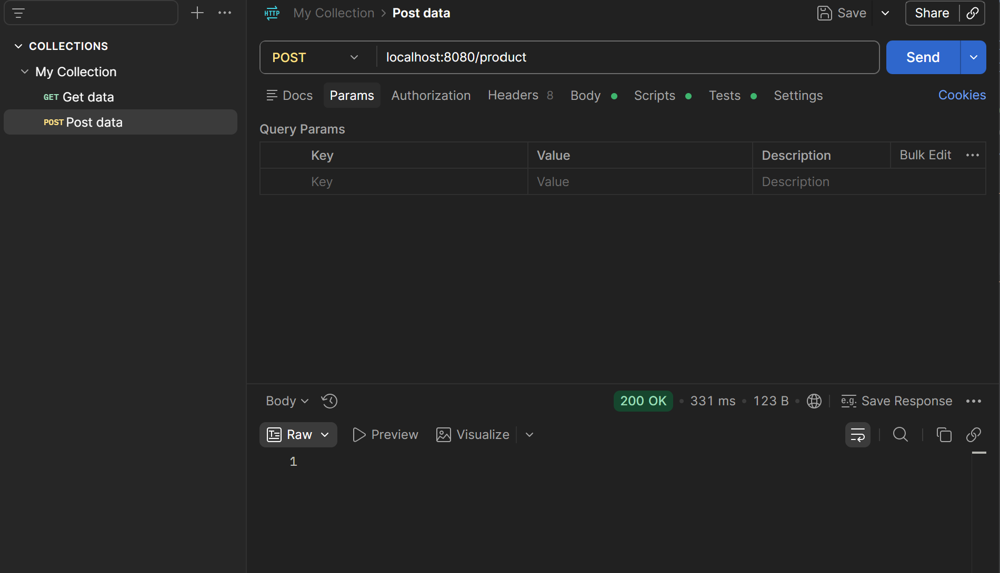

## Postman
- 메서드를 테스트할 수 있는 개발 도구
    - 웹 브라우저에서는 메서드를 테스트할 수 없다는 한계가 존재한다.
- 등록이나 수정을 하기 위해서는, 요청을 할 때 데이터를 같이 줘야한다.
    - Request에도 결론적으로 Response 처럼 Body가 존재 한다! (URL + Method + Body)
    - view가 없는 웹 브라우저에서는 body를 줄 방법이 없다 → Postman 사용

- POST 테스트

- GET 테스트


## 주소(URL)에 데이터를 받아오는 방법
1. Query String (쿼리 스트링)
    - http://localhost:8080/products?name=_____
    - ```?``` 로 변수를 주소와 구분 짓는다.

    - Controller : ```@RequestParam``` 어노테이션을 통해 명시
    ```java
    @RequestMapping(value="/products", method = RequestMethod.POST)
    public void saveProduct(@RequestParam(value="name") String productName) {       // 매개변수로 상품명
            productService.saveProduct();
    }
    ```
    - Controller에서 사용자로부터 데이터를 받은 후, Controller → Service → Repository 순으로 매개변수를 통해 데이터를 전달한다.

2. Path Variable
    - http://localhost:8080/products/2
    - Controller : ```@PathVariable``` 어노테이션을 통해 명시
    ```java
    @RequestMapping(value="/products/{id}", method= RequestMethod.GET)
    public String getProduct(@PathVariable("id") int id) {
        return productService.getProduct(id);
    }
    ```