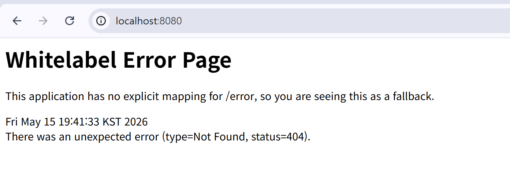

## IoC 구현 두가지 방법
1. `@Component class _____{}`
    - 해당 클래스를 객체로 생성해서 스프링 빈으로 등록하라고(=컨테이너에 넣으라고) 명시
2. `@Configuration` + `@Bean`


```java
// ProductController.java
@Component
public class ProductController {
    // 생성자
    ProductController() {
        System.out.println("really?");      // 객체가 진짜 생성됐는지 확인하기 위한 출력
    }
}
```

- 실행 결과 (로그)

    ```
    2026-05-15T19:40:43.915+09:00  INFO 22512 --- [demo] [           main] com.example.demo.DemoApplication    
    : Starting DemoApplication using Java 17.0.19 with PID 22512 (main 경로 started by 사용자 in 프로젝트 경로)
    ```
    - Java 17.0.19 버전으로 DempApplication 이 실행되고 있다.

    ```
    2026-05-15T19:40:44.949+09:00  INFO 22512 --- [demo] [           main] o.s.b.w.embedded.tomcat.TomcatWebServer    
    : Tomcat initialized with port 8080 (http)
    ```
    - Tomcat이 포트 8080번을 통해 초기화되었다.

    ```
    really?
    ```
    - "really?" 가 출력됨을 통해, 객체가 정상적으로 생성되었음을 확인할 수 있다.

## Apache Tomcat
- **Apache** : Tomcat을 개발한 오픈 소스 개발 지원 비영리 재단 이름
- **Tomcat** : 스프링 부트 웹 애플리케이션에 내장되어, 웹 요청을 받고 응답을 보내는 웹 서버 역할

### [http://localhost:8080](http://localhost:8080)
- http를 사용할 것이고, localhost (사용자 컴퓨터의 주소)에서 8080번 서비스 포트를 사용할 것이라는 의미
- **port** : 항구를 뜻하는 단어. 지정한 컴퓨터에서도 어떤 포트로 들어갈 것인지를 지정
- 원하는 서비스 (API) 마다 포트를 지정하고, 그 포트를 통해 들어오게끔 한다 (서비스 포트)



### Controller 의 역할
- 어떤 주소로 찾아왔을 때, 위와 같이 에러페이지를 띄우는 것을 대신해 대응 방안을 마련
- `@Controller` 어노테이션을 통해 구현 : 이미 `@Component` 어노테이션을 포함하므로, 스프링에게 다음 클래스를 스프링 빈으로 등록하고 + 컨트롤러로 사용할 것이라고 명시하는 역할을 한다.
- Controller Class 구조 확인 (ctrl + 클릭)


    ```java
    // Controller.class

    @Documented
    @Component      // Controller 안에 Component 어노테이션이 이미 포함되어 있음
    public @interface Controller {
        @AliasFor(
            annotation = Component.class
        )
        String value() default "";
    }
    ```

    > Controller.class 안의 JavaDoc 내용   
    > ...   
    > It is typically used in combination wit annotated handler methods based on the   
    > {@link org.springframework.web.bind.annotation.RequestMapping} annotation   
    > ...

    - `@RequestMapping` 이라는 Annotation으로 annotated된 handler method와 조합해서 특별하게 사용됨을 확인할 수 있다.
    - **핸들러(handler)** : 일반 메서드와 달리, 개발자가 아니라 사용자의 요청에 의해 자동으로 호출되는 메서드