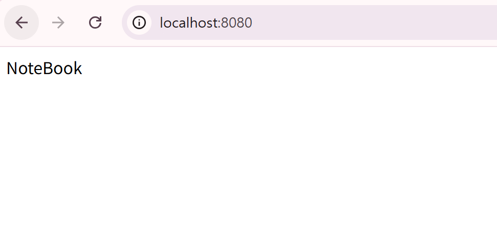

## @RequestMapping과 핸들러 메소드
- 특정 **URL**과 **HTTP 메서드**에 맞는 **사용자 요청**이 왔을 때 **어떤 메서드**를 실행할지 스프링에게 알려주는 역할. 요청과 코드를 연결한다.
- @Controller 어노테이션은 Component 어노테이션을 포함하므로, Component 어노테이션 생략 가능!
```java
// ProductController 내부
// localhost:8080 요청에 대한 메서드 지정 : 이 서비스의 메인 주소이기 때문에, 생략 가능
@RequestMapping(value="", method=RequestMethod.GET)
public String getProduct() {
    return "NoteBook";
}
```

## HTTP
1. **Request**
- **URL (주소)**
- **Method (목적)**
    - 조회 : GET
    - 등록/생성/삽입 : POST
    - 수정 : (전체) PUT / (부분) PATCH
    - 삭제 : DELETE
- cf. CRUD (Create Read Update Delete) : 데이터 연산과 관련된 모든 곳에서 CRUD라는 개념 적용 가능!
2. **Response**
- (Response)Body : 이곳에 데이터를 담아서 반환

## @RestController
- @Controller : 백엔드와 프론트엔드가 나뉘기 전, 풀스택으로서의 옛날 웹개발 방식에서 사용됐음
    - 스프링은 화면을 만들어 templete에 담을 수 있다. 따라서 해당 어노테이션은 화면을 보내는 어노테이션

- **@RestController = @Cotroller + @ResponseBody**
    - @Controller : 스프링에서 웹 요청을 처리
    - @ResponseBody :  메서드의 반환 값을 HTTP 응답 본문에 직접 넣음
    - 주로 REST API 개발에 사용된다.

```java
// @RestController 사용 or @Controller + @ResponseBody로 쪼개서 사용
@Controller
@ResponseBody
public class ProductController {
    // 상품 조회, 상품 등록 담당
}
```

- @ResponseBody 어노테이션을 추가해서 HTTP 구조 완성, 따라서 http://localhost:8080 페이지에는 Whitelabel 에러페이지 대신, 리턴값으로 설정한 NoteBook 문자열이 반환된다.   
